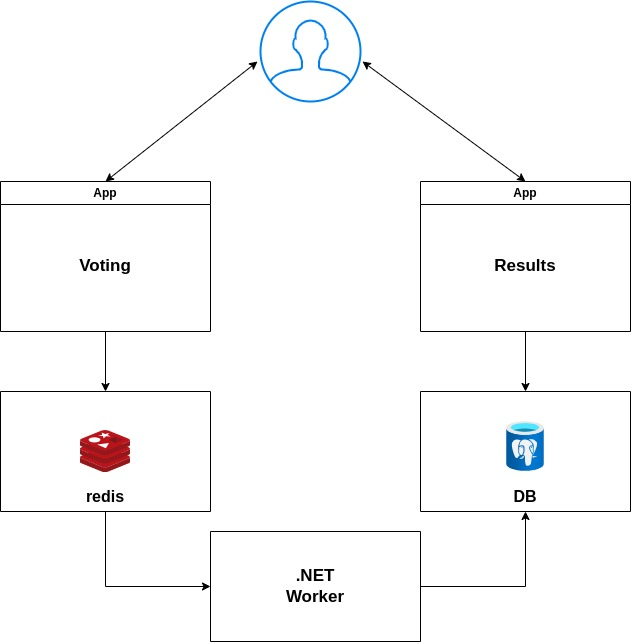

# Voting-app-dockerExample

A straightforward distributed application deployed on multiple Docker containers.

## **Getting Started:**

This program uses Python, Node.js, .NET, with Redis for messaging and Postgres for storage.

Run in this directory to build and run the app:

``` shell
docker compose up
```

## **Architecture:**



A Python-based frontend web application enabling voting between two options, coupled with a Redis instance for aggregating new votes. A .NET worker processes and stores votes in a Postgres database, supported by a Docker volume. Additionally, a Node.js web application provides real-time displays of the voting results.
